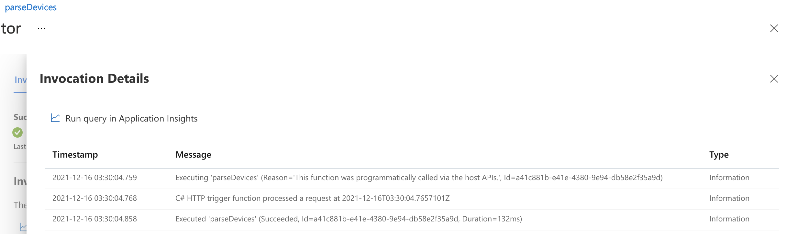
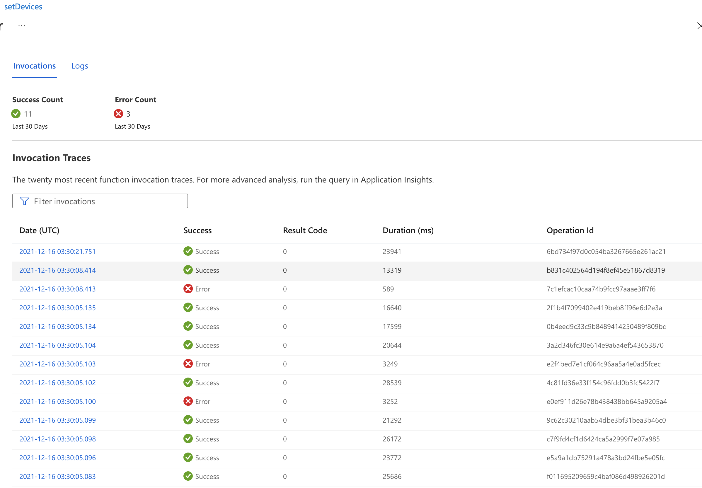
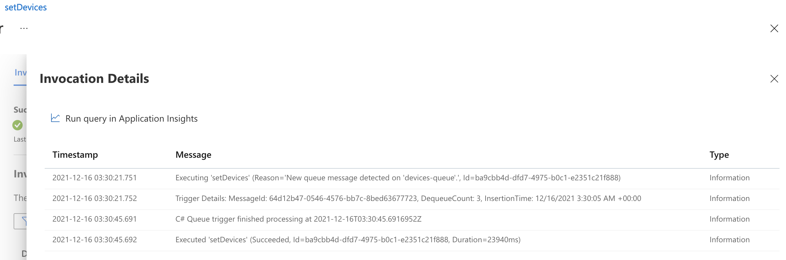

# build 
The project will be built and deployed upon code push. In order to deploy it with your Azure portal account follow the steps described here
https://docs.microsoft.com/en-us/azure/azure-resource-manager/bicep/deploy-github-actions?tabs=CLI#generate-deployment-credentials

However, the command to generate should be shortened as following:

```
az ad sp create-for-rbac --name myApp --role contributor --scopes /subscriptions/{subscription-id} --sdk-auth
```

# performance
The function was invoked at 2021-12-16T03:30:04.7657101Z



There were a few fails during the execution



The last queue was processed at 2021-12-16T03:30:45.6916952Z



The total time is ~41 seconds